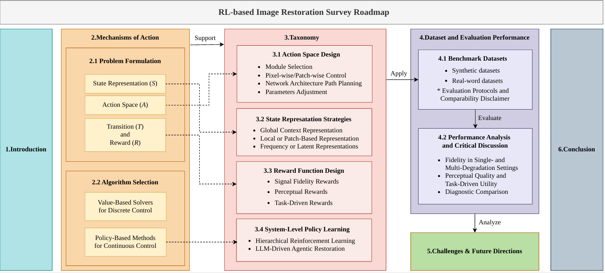

# Reinforcement Learning for Intelligent Image Restoration: A Survey on Algorithms, Applications, and Engineering Challenges

This repository provides a collection of papers, benchmarks, and resources from our survey:  Reinforcement Learning for Intelligent Image Restoration: A Survey on Algorithms, Applications, and Engineering Challenges

---

## Abstract

While Deep Learning (DL) has revolutionized Image Restoration (IR), standard models typically rely on static, one-pass inference, which fails to adapt to the complex, entangled degradation patterns encountered in real-world engineering systems. 
Reinforcement Learning (RL) addresses these limitations by reformulating restoration as a sequential decision-making process, thereby enabling dynamic policy optimization, enhanced interpretability, and adaptive resource allocation. 
This paper provides a comprehensive survey of this evolving landscape, systematically analyzing how RL bridges the gap between signal fidelity and decision-theoretic control. 
We propose a novel taxonomy rooted in Action Space Design, categorizing methodologies into Module Selection, Pixel-wise Restoration, and Parameter Tuning strategies. 
Beyond algorithmic mechanisms, we critically evaluate the performance of mainstream RL methods on public benchmarks, highlighting their superior robustness in multi-degradation and blind restoration scenarios compared to static baselines. 
Finally, we dissect critical engineering challenges—including reward sparsity, the Sim-to-Real gap, and real-time edge deployment—and envision future directions that are driven by Large Multimodal Models and Agentic Frameworks. 
This survey serves as a foundational roadmap for the development of the next generation of autonomous and intelligent vision systems.

## Overview

 

---

## Content

- 📣 [News](#news)
- 📄 [Paper List](#paper-list)
  - [Action Space Design](#Ⅰ-action-space-design)
  - [State Representation Strategies](#Ⅱ-state-representation-strategies)
  - [Reward function design](#Ⅲ-reward-function-design)
  - [System-Level Policy Learning](#Ⅳ-system-level-policy-learning)
- 🗂️ [Datasets](#datasets)
  - [Synthetic datasets](#synthetic-datasets)
  - [Real-world datasets](#real-world-datasets)
- 💯 [Evaluation](#performance-evaluation)

---

## News

- 2025-03: Repository initialized.
- 2026-06：EAAI revise

## Paper List

We categorize recent RL-restore papers by components:

### Ⅰ Action Space Design

#### 1 Module selection

<table>
<thead>
<tr>
<th align="center">Name</th>
<th align="left">Title</th>
<th align="center">Publication</th>
<th align="center">Date</th>
<th align="center">Tags</th>
<th align="center">Code</th>
</tr>
</thead>
<tbody>
<tr>
  <td align="center">
    <a href="https://arxiv.org/pdf/1804.03312.pdf">
      RL-Restore
    </a>
  </td>
  <td align="left">
    Crafting a toolchain for image restoration by deep reinforcement learning
  </td>
  <td align="center">CVPR</td>
  <td align="center">2018</td>
  <td align="center">module selection</td>
  <td align="center"><a href="https://github.com/yuke93/RL-Restore">github</a></td>
</tr>
<tr>
  <td align="center">
    <a href="https://openaccess.thecvf.com/content_CVPR_2019/papers/Suganuma_Attention-Based_Adaptive_Selection_of_Operations_for_Image_Restoration_in_the_CVPR_2019_paper.pdf">
      Suganuma et al.
    </a>
  </td>
  <td align="left">
    Attention-Based Adaptive Selection of Operations for Image Restoration in the Presence of Unknown Combined Distortions
  </td>
  <td align="center">CVPR</td>
  <td align="center">2019</td>
  <td align="center">module selection</td>
  <td align="center"><a href="https://github.com/sg-nm/Operation-wise-attention-network">github</a></td>
</tr>
<tr>
  <td align="center">
    <a href="https://ieeexplore.ieee.org/document/9746115">
      JE2NET
    </a>
  </td>
  <td align="left">
    JE2NET: Joint Exploitation and Exploration in Reinforcement Learning Based Image Restoration
  </td>
  <td align="center">ICASSP</td>
  <td align="center">2022</td>
  <td align="center">module selection</td>
  <td align="center">github</td>
</tr>
<tr>
  <td align="center">
    <a href="https://arxiv.org/abs/2207.12056">
      REPNP
    </a>
  </td>
  <td align="left">
    REPNP: Plug-and-Play with Deep Reinforcement Learning Prior for Robust Image Restoration
  </td>
  <td align="center">ICIP</td>
  <td align="center">2022</td>
  <td align="center">module selection</td>
  <td align="center">github</td>
</tr>
<tr>
  <td align="center">
    <a href="https://ieeexplore.ieee.org/abstract/document/9277382">
      RL-Dehaze
    </a>
  </td>
  <td align="left">
    Single image dehazing via reinforcement learning
  </td>
  <td align="center">ICIBA</td>
  <td align="center">2020</td>
  <td align="center">module selection</td>
  <td align="center">github</td>
</tr>
<tr>
  <td align="center">
    <a href="https://www.sciencedirect.com/science/article/pii/S0167865524001181">
      Ye et al.
    </a>
  </td>
  <td align="left">
    Low-quality image object detection based on reinforcement learning adaptive enhancement
  </td>
  <td align="center">Pattern Recognition Letters</td>
  <td align="center">2024 </td>
  <td align="center">module selection</td>
  <td align="center">github</td>
</tr>  
<tr>
  <td align="center">
    <a href="https://ieeexplore.ieee.org/abstract/document/9751218">
      Li et al.
    </a>
  </td>
  <td align="left">
    Underwater Image Enhancement With Reinforcement Learning
  </td>
  <td align="center"> IEEE </td>
  <td align="center">2024</td>
  <td align="center">module selection</td>
  <td align="center"><a href="https://gitee.com/sunshixin_upc/underwater-image-enhancement-with-reinforcement-learning">github</a></td>
</tr>
</tbody>
</table>

#### 2 Restoration Degree Control

<table>
<thead>
<tr>
<th align="center">Name</th>
<th align="left">Title</th>
<th align="center">Publication</th>
<th align="center">Date</th>
<th align="center">Tags</th>
<th align="center">Code</th>
</tr>
</thead>
<tbody>
<tr>
  <td align="center">
    <a href="https://ieeexplore.ieee.org/document/8936404">
      PixelRL
    </a>
  </td>
  <td align="left">
    PixelRL: Fully Convolutional Network With Reinforcement Learning for Image Processing
  </td>
  <td align="center"> IEEE </td>
  <td align="center">2020</td>
  <td align="center">Restoration Degree Control</td>
  <td align="center"><a href="https://github.com/rfuruta/pixelRL">github</a></td>
</tr>
<tr>
  <td align="center">
    <a href="https://ojs.aaai.org/index.php/AAAI/article/view/5423">
      MRI-RL
    </a>
  </td>
  <td align="left">
    MRI Reconstruction with Interpretable Pixel-Wise Operations Using Reinforcement Learning
  </td>
  <td align="center">AAAI</td>
  <td align="center">2020</td>
  <td align="center">Restoration Degree Control</td>
  <td align="center">github</td>
</tr>
<tr>
  <td align="center">
    <a href="https://ieeexplore.ieee.org/document/9593591">
      Jarosik et al.
    </a>
  </td>
  <td align="left">
    Pixel-wise deep reinforcement learning approach for ultrasound image denoising
  </td>
  <td align="center">IEEE</td>
  <td align="center">2021</td>
  <td align="center">Restoration Degree Control</td>
  <td align="center">github</td>
</tr>
<tr>
  <td align="center">
    <a href="https://link.springer.com/article/10.1007/s11042-019-07914-5">
      Ke et al.
    </a>
  </td>
  <td align="left">
    Image registration optimization mechanism based on reinforcement learning and real time denoising
  </td>
  <td align="center">SPRINGER</td>
  <td align="center">2020</td>
  <td align="center">Restoration Degree Control/Multi-agent RL </td>
  <td align="center">github</td>
</tr> 
<tr>
  <td align="center">
    <a href="https://ieeexplore.ieee.org/abstract/document/9506323">
      R3L
    </a>
  </td>
  <td align="left">
    R3l: Connecting deep reinforcement learning to recurrent neural networks for image denoising via residual recovery
  </td>
  <td align="center">IEEE</td>
  <td align="center">2021</td>
  <td align="center">Restoration Degree Control</td>
  <td align="center">github</td>
</tr>
<tr>
  <td align="center">
    <a href="https://arxiv.org/abs/2403.18270">
      RL-Deraining
    </a>
  </td>
  <td align="left">
    Image deraining via self-supervised reinforcement learning
  </td>
  <td align="center">arxiv</td>
  <td align="center">2024</td>
  <td align="center">Restoration Degree Control</td>
  <td align="center"><a href="https://github.com/JasonHippo/Image_Deraining_via_Self-supervised_Reinforcement_Learning">github</a></td>
</tr>
</tbody>
</table>

#### 3 Network Architecture Path Planning

<table>
<thead>
<tr>
<th align="center">Name</th>
<th align="left">Title</th>
<th align="center">Publication</th>
<th align="center">Date</th>
<th align="center">Tags</th>
<th align="center">Code</th>
</tr>
</thead>
<tbody>
<tr>
  <td align="center">
    <a href="https://openaccess.thecvf.com/content_ICCV_2019/papers/Gong_AutoGAN_Neural_Architecture_Search_for_Generative_Adversarial_Networks_ICCV_2019_paper.pdf">
      AutoGAN
    </a>
  </td>
  <td align="left">
    AutoGAN: Neural Architecture Search for Generative Adversarial Networks
  </td>
  <td align="center">ICCV</td>
  <td align="center">2019</td>
  <td align="center">Network Architecture Path Planning</td>
  <td align="center"><a href="https://github.com/VITA-Group/AutoGAN">github</td>
</tr>
<tr>
  <td align="center">
    <a href="https://arxiv.org/abs/1904.10343">
      Path-Restore
    </a>
  </td>
  <td align="left">
    Path-restore: Learning network path selection for image restoration
  </td>
  <td align="center">IEEE</td>
  <td align="center">2019</td>
  <td align="center">Network Architecture Path Planning</td>
  <td align="center"><a href="https://www.mmlab-ntu.com/project/pathrestore/">github</td>
</tr>
<tr>
  <td align="center">
    <a href="https://ieeexplore.ieee.org/document/10409270">
      Pathnet
    </a>
  </td>
  <td align="left">
    Pathnet: Path-selective point cloud denoising
  </td>
  <td align="center">IEEE</td>
  <td align="center">2024</td>
  <td align="center">Network Architecture Path Planning</td>
  <td align="center"><a href="https://github.com/ZeyongWei/PathNet">github</a></td>
</tr>
<tr>
  <td align="center">
    <a href="https://arxiv.org/abs/2507.07105">
      4KAgent
    </a>
  </td>
  <td align="left">
    4KAgent: Agentic Any Image to 4K Super-Resolution 
  </td>
  <td align="center">arxiv</td>
  <td align="center">2025</td>
  <td align="center">Network Architecture Path Planning</td>
  <td align="center"><a href="https://github.com/taco-group/4KAgent">github</td>
</tr>
</tbody>
</table>

#### 4 Parameter Adjustment

<table>
<thead>
<tr>
<th align="center">Name</th>
<th align="left">Title</th>
<th align="center">Publication</th>
<th align="center">Date</th>
<th align="center">Tags</th>
<th align="center">Code</th>
</tr>
</thead>
<tbody>
<tr>
  <td align="center">
    <a href="https://arxiv.org/abs/1804.04450">
      Distort-and-Recover
    </a>
  </td>
  <td align="left">
    Distort-and-recover: Color enhancement using deep reinforcement learning
  </td>
  <td align="center">CVPR</td>
  <td align="center">2018</td>
  <td align="center">Parameter Adjustment</td>
  <td align="center"><a href="https://sites.google.com/view/distort-and-recover/">github</a></td>
</tr>
<tr>
  <td align="center">
    <a href="https://dl.acm.org/doi/abs/10.1145/3181974">
      Exposure
    </a>
  </td>
  <td align="left">
    Exposure: A White-Box Photo Post-Processing Framework
  </td>
  <td align="center">ACM</td>
  <td align="center">2018</td>
  <td align="center">Parameter Adjustment</td>
  <td align="center">github</td>
</tr>
<tr>
  <td align="center">
    <a href="https://arxiv.org/abs/2107.05830">
      ReLLIE
    </a>
  </td>
  <td align="left">
    Rellie: Deep reinforcement learning for customized low-light image enhancement
  </td>
  <td align="center">ACM MM</td>
  <td align="center">2021</td>
  <td align="center">Parameter Adjustment/image enhancement</td>
  <td align="center"><a href="https://github.com/GuoLanqing/ReLLIE">github</a></td>
</tr>
<tr>
  <td align="center">
    <a href="https://ieeexplore.ieee.org/document/10083088">
      Xi et al.
    </a>
  </td>
  <td align="left">
    Image enhancement using adaptive region- guided multi-step exposure fusion based on reinforcement learning
  </td>
  <td align="center">IEEE</td>
  <td align="center">2023</td>
  <td align="center">Parameter Adjustment/image enhancement</td>
  <td align="center">github</td>
</tr>
<tr>
  <td align="center">
    <a href="https://ojs.aaai.org/index.php/AAAI/article/view/28307">
      RL-SeqISP
    </a>
  </td>
  <td align="left">
    RL-SeqISP: Reinforcement Learning-Based Sequential Optimization for Image Signal Processing
  </td>
  <td align="center">AAAI</td>
  <td align="center">2024</td>
  <td align="center">Parameter Adjustment/ISP</td>
  <td align="center">github</td>
</tr>
<tr>
  <td align="center">
    <a href="https://ieeexplore.ieee.org/abstract/document/10497123">
      Metalantis
    </a>
  </td>
  <td align="left">
    Metalantis: A Comprehensive Underwater Image Enhancement Framework
  </td>
  <td align="center">IEEE</td>
  <td align="center">2024</td>
  <td align="center">Parameter Adjustment/underwater enhancement</td>
  <td align="center"><a href="https://gitee.com/wanghaoupc/Metalantis_UIE">github</a></td>
</tr>
<tr>
  <td align="center">
    <a href="https://www.sciencedirect.com/science/article/pii/S0952197624005694">
      Inspiration
    </a>
  </td>
  <td align="left">
    INSPIRATION: A reinforcement learning-based human visual perception-driven image enhancement paradigm for underwater scenes
  </td>
  <td align="center">EAAI</td>
  <td align="center">2024</td>
  <td align="center">Parameter Adjustment/underwater enhancement</td>
  <td align="center"><a href="https://gitee.com/wanghaoupc/uie_inspiration">github</a></td>
</tr>
<tr>
  <td align="center">
    <a href="https://proceedings.neurips.cc/paper_files/paper/2023/hash/fc65fab891d83433bd3c8d966edde311-Abstract-Conference.html">
      DPOK
    </a>
  </td>
  <td align="left">
    DPOK: Reinforcement Learning for Fine-tuning Text-to-Image Diffusion Models
  </td>
  <td align="center">NeurIPS</td>
  <td align="center">2023</td>
  <td align="center">Parameter Adjustment/Diffusion model</td>
  <td align="center"><a href="https://github.com/google-research/google-research/tree/master/dpok">github</a></td>
</tr>
<tr>
  <td align="center">
    <a href="https://arxiv.org/abs/2511.01645">
      Xu et al.
    </a>
  </td>
  <td align="left">
    Enhancing Diffusion-based Restoration Models via Difficulty-Adaptive Reinforcement Learning with IQA Reward
  </td>
  <td align="center">arxiv</td>
  <td align="center">2025</td>
  <td align="center">Parameter Adjustment</td>
  <td align="center">github</a></td>
</tr>
  <tr>
  <td align="center">
    <a href="https://arxiv.org/abs/2603.27742">
      TIR-Agent
    </a>
  </td>
  <td align="left">
    TIR-Agent: Training an Explorative and Efficient Agent for Image Restoration
  </td>
  <td align="center">arxiv</td>
  <td align="center">2026</td>
  <td align="center">Parameter Adjustment/image restoration agent</td>
  <td align="center">github</td>
</tr>
<tr>
  <td align="center">
    <a href="https://www.mdpi.com/2079-9292/14/17/3357">
      DPO-ESRGAN
    </a>
  </td>
  <td align="left">
    DPO-ESRGAN: Perceptually Enhanced Super-Resolution Using Direct Preference Optimization
  </td>
  <td align="center">Electronics</td>
  <td align="center">2025</td>
  <td align="center">Parameter Adjustment/super-resolution/preference optimization</td>
  <td align="center">github</td>
</tr>
<tr>
  <td align="center">
    <a href="https://ojs.aaai.org/index.php/AAAI/article/view/37520">
      TTPO
    </a>
  </td>
  <td align="left">
    Test-Time Preference Optimization for Image Restoration
  </td>
  <td align="center">AAAI</td>
  <td align="center">2026</td>
  <td align="center">Parameter Adjustment/test-time optimization/preference optimization</td>
  <td align="center">github</td>
</tr>
<tr>
  <td align="center">
    <a href="https://arxiv.org/abs/2510.18851">
      DP2O-SR
    </a>
  </td>
  <td align="left">
    DP2O-SR: Direct Perceptual Preference Optimization for Real-World Image Super-Resolution
  </td>
  <td align="center">NeurIPS</td>
  <td align="center">2026</td>
  <td align="center">Parameter Adjustment/real-world super-resolution/preference optimization</td>
  <td align="center">github</td>
</tr>

<tr>
  <td align="center">
    <a href="https://arxiv.org/abs/2511.01645">
      Xu et al.
    </a>
  </td>
  <td align="left">
    Enhancing Diffusion-based Restoration Models via Difficulty-Adaptive Reinforcement Learning with IQA Reward
  </td>
  <td align="center">arxiv</td>
  <td align="center">2025</td>
  <td align="center">Parameter Adjustment/diffusion model/IQA reward</td>
  <td align="center">github</td>
</tr>
<tr>
  <td align="center">
    <a href="https://arxiv.org/abs/2508.08189">
      Wu et al.
    </a>
  </td>
  <td align="left">
    Reinforcement Learning for Large Model: A Survey
  </td>
  <td align="center">arxiv</td>
  <td align="center">2025</td>
  <td align="center">Survey/large model/reinforcement learning</td>
  <td align="center">github</td>
</tr>

</tbody>
</table>

### Ⅱ State Representation Strategies

#### 1 Global Context Representation

<table>
<thead>
<tr>
<th align="center">Name</th>
<th align="left">Title</th>
<th align="center">Publication</th>
<th align="center">Date</th>
<th align="center">Tags</th>
<th align="center">Code</th>
</tr>
</thead>
<tbody>
<tr>
  <td align="center">
    <a href="https://arxiv.org/pdf/1804.03312.pdf">
      RL-Restore
    </a>
  </td>
  <td align="left">
    Crafting a toolchain for image restoration by deep reinforcement learning
  </td>
  <td align="center">CVPR</td>
  <td align="center">2018</td>
  <td align="center">Global Context Representation</td>
  <td align="center"><a href="https://github.com/yuke93/RL-Restore">github</a></td>
</tr>
<tr>
  <td align="center">
    <a href="https://ieeexplore.ieee.org/document/9746115">
      JE2NET
    </a>
  </td>
  <td align="left">
    JE2NET: Joint Exploitation and Exploration in Reinforcement Learning Based Image Restoration
  </td>
  <td align="center">ICASSP</td>
  <td align="center">2022</td>
  <td align="center">Global Context Representation</td>
  <td align="center">github</td>
</tr>
<tr>
  <td align="center">
    <a href="https://proceedings.neurips.cc/paper_files/paper/2024/hash/5255f5dcf1bd6532aed9470bb556c64a-Abstract-Conference.html">
      Wu et al.
    </a>
  </td>
  <td align="left">
    Goal Conditioned Reinforcement Learning for Photo Finishing Tuning
  </td>
  <td align="center">NeurIPS</td>
  <td align="center">2024</td>
  <td align="center">Global Context Representation</td>
  <td align="center"><a href="https://github.com/OpenImagingLab/RLPixTuner">github</a></td>
</tr>
<tr>
  <td align="center">
    <a href="https://ieeexplore.ieee.org/abstract/document/9981361">
      DRL-ISP
    </a>
  </td>
  <td align="left">
    DRL-ISP: Multi-Objective Camera ISP with Deep Reinforcement Learning
  </td>
  <td align="center">IEEE</td>
  <td align="center">2022</td>
  <td align="center">Global Context Representation</td>
  <td align="center"><a href="https://github.com/UkcheolShin/DRL-ISP">github</a></td>
</tr>
<tr>
  <td align="center">
    <a href="https://arxiv.org/abs/2511.01645">
      Xu et al.
    </a>
  </td>
  <td align="left">
    Enhancing Diffusion-based Restoration Models via Difficulty-Adaptive Reinforcement Learning with IQA Reward
  </td>
  <td align="center">arxiv</td>
  <td align="center">2025</td>
  <td align="center">Global Context Representation</td>
  <td align="center">github</a></td>
</tr>
</tbody>
</table>

#### 2 Local and Patch-Based Representation

<table>
<thead>
<tr>
<th align="center">Name</th>
<th align="left">Title</th>
<th align="center">Publication</th>
<th align="center">Date</th>
<th align="center">Tags</th>
<th align="center">Code</th>
</tr>
</thead>
<tbody>
<tr>
  <td align="center">
    <a href="https://ojs.aaai.org/index.php/AAAI/article/view/5423">
      MRI-RL
    </a>
  </td>
  <td align="left">
    MRI Reconstruction with Interpretable Pixel-Wise Operations Using Reinforcement Learning
  </td>
  <td align="center">AAAI</td>
  <td align="center">2020</td>
  <td align="center">Local and Patch-Based Representation</td>
  <td align="center">github</td>
</tr>
<tr>
  <td align="center">
    <a href="https://arxiv.org/abs/2403.18270">
      RL-Deraining
    </a>
  </td>
  <td align="left">
    Image deraining via self-supervised reinforcement learning
  </td>
  <td align="center">arxiv</td>
  <td align="center">2024</td>
  <td align="center">Local and Patch-Based Representation</td>
  <td align="center"><a href="https://github.com/JasonHippo/Image_Deraining_via_Self-supervised_Reinforcement_Learning">github</a></td>
</tr>
</tbody>
</table>

#### 3 Latent and Frequency Representations

<table>
<thead>
<tr>
<th align="center">Name</th>
<th align="left">Title</th>
<th align="center">Publication</th>
<th align="center">Date</th>
<th align="center">Tags</th>
<th align="center">Code</th>
</tr>
</thead>
<tbody>
<tr>
  <td align="center">
    <a href="https://ojs.aaai.org/index.php/AAAI/article/view/5423">
      Rafailov et al.
    </a>
  </td>
  <td align="left">
    Offline Reinforcement Learning from Images with Latent Space Models
  </td>
  <td align="center">PMLR</td>
  <td align="center">2020</td>
  <td align="center">Latent and Frequency Representations</td>
  <td align="center"><a href="https://github.com/rmrafailov/LOMPO">github</a></td>
</tr>
<tr>
  <td align="center">
    <a href="https://arxiv.org/abs/2507.07105">
      4KAgent
    </a>
  </td>
  <td align="left">
    4KAgent: Agentic Any Image to 4K Super-Resolution 
  </td>
  <td align="center">arxiv</td>
  <td align="center">2025</td>
  <td align="center">Network Architecture Path Planning</td>
  <td align="center"><a href="https://github.com/taco-group/4KAgent">github</td>
</tr>
</tbody>
</table>

### Ⅲ Reward function design

#### 1 Signal Fidelity Rewards (Reference-Based)

<table>
<thead>
<tr>
<th align="center">Name</th>
<th align="left">Title</th>
<th align="center">Publication</th>
<th align="center">Date</th>
<th align="center">Tags</th>
<th align="center">Code</th>
</tr>
</thead>
<tbody>
<tr>
  <td align="center">
    <a href="https://www.mdpi.com/1424-8220/20/21/5983">
      Xie et al.
    </a>
  </td>
  <td align="left">
    Multi-Frame Star Image Denoising Algorithm Based on Deep Reinforcement Learning and Mixed Poisson–Gaussian Likelihood
  </td>
  <td align="center">MDPI</td>
  <td align="center">2020</td>
  <td align="center">Signal Fidelity Rewards</td>
  <td align="center">github</a></td>
</tr>
<tr>
  <td align="center">
    <a href="https://ieeexplore.ieee.org/abstract/document/10240097">
      Lei et al.
    </a>
  </td>
  <td align="left">
    Mixed Distorted Image Restoration Based on Residual Double Deep Q Network
  </td>
  <td align="center">IEEE</td>
  <td align="center">2023</td>
  <td align="center">Signal Fidelity Rewards</td>
  <td align="center">github</td>
</tr>
</tbody>
</table>

#### 2 Perceptual Rewards (Reference-Free)

<table>
<thead>
<tr>
<th align="center">Name</th>
<th align="left">Title</th>
<th align="center">Publication</th>
<th align="center">Date</th>
<th align="center">Tags</th>
<th align="center">Code</th>
</tr>
</thead>
<tbody>
<tr>
  <td align="center">
    <a href="https://dl.acm.org/doi/full/10.1145/3532625">
      Zhang et al.
    </a>
  </td>
  <td align="left">
    Image Quality Assessment–driven Reinforcement Learning for Mixed Distorted Image Restoration
  </td>
  <td align="center">ACM</td>
  <td align="center">2023</td>
  <td align="center">Perceptual Rewards</td>
  <td align="center">github</a></td>
</tr>
<tr>
  <td align="center">
    <a href="https://arxiv.org/abs/2506.16796">
      RealSR-R1
    </a>
  </td>
  <td align="left">
    RealSR-R1: Reinforcement Learning for Real-World Image Super-Resolution with Vision-Language Chain-of-Thought
  </td>
  <td align="center">arxiv</td>
  <td align="center">2025</td>
  <td align="center">Perceptual Rewards</td>
  <td align="center"><a href="https://github.com/Junboooo/RealSR-R1">github</a></td>
</tr>
<tr>
  <td align="center">
    <a href="https://openaccess.thecvf.com/content/CVPR2026F/html/Lu_Restore-R1_Efficient_Image_Restoration_Agents_via_Reinforcement_Learning_with_Multimodal_CVPRF_2026_paper.html">
      Restore-R1
    </a>
  </td>
  <td align="left">
    Restore-R1: Efficient Image Restoration Agents via Reinforcement Learning with Multimodal LLM Perceptual Feedback
  </td>
  <td align="center">CVPR</td>
  <td align="center">2026</td>
  <td align="center">Parameter Adjustment/image restoration agent/MLLM feedback</td>
  <td align="center">github</td>
</tr>
</tbody>
</table>

#### 3 Task-Driven Rewards (Downstream Performance)

<table>
<thead>
<tr>
<th align="center">Name</th>
<th align="left">Title</th>
<th align="center">Publication</th>
<th align="center">Date</th>
<th align="center">Tags</th>
<th align="center">Code</th>
</tr>
</thead>
<tbody>
<tr>
  <td align="center">
    <a href="https://ieeexplore.ieee.org/abstract/document/9981361">
      DRL-ISP
    </a>
  </td>
  <td align="left">
    DRL-ISP: Multi-Objective Camera ISP with Deep Reinforcement Learning
  </td>
  <td align="center">IEEE</td>
  <td align="center">2022</td>
  <td align="center">Task-Driven Rewards</td>
  <td align="center"><a href="https://github.com/UkcheolShin/DRL-ISP">github</a></td>
</tr>
<tr>
  <td align="center">
    <a href="https://arxiv.org/abs/2408.06803">
       Bartolo et al.
    </a>
  </td>
  <td align="left">
    Integrating Saliency Ranking and Reinforcement Learning for Enhanced Object Detection
  </td>
  <td align="center">arxiv</td>
  <td align="center">2024</td>
  <td align="center">Task-Driven Rewards</td>
  <td align="center"><a href="https://github.com/mbar0075/SaRLVision">github</a></td>
</tr>
<tr>
  <td align="center">
    <a href="https://www.sciencedirect.com/science/article/pii/S0167865524001181">
      Ye et al.
    </a>
  </td>
  <td align="left">
    Low-quality image object detection based on reinforcement learning adaptive enhancement
  </td>
  <td align="center">Pattern Recognition Letters</td>
  <td align="center">2024 </td>
  <td align="center">Task-Driven Rewards</td>
  <td align="center">github</td>
</tr>  
<tr>
  <td align="center">
    <a href="https://arxiv.org/abs/2506.16796">
      AdaptiveISP
    </a>
  </td>
  <td align="left">
    AdaptiveISP: Learning an Adaptive Image Signal Processor for Object Detection
  </td>
  <td align="center">NeurIPS</td>
  <td align="center">2024</td>
  <td align="center">Task-Driven Rewards</td>
  <td align="center"><a href="https://github.com/OpenImagingLab/AdaptiveISP">github</a></td>
</tr>
<tr>
  <td align="center">
    <a href="https://www.frontiersin.org/journals/plant-science/articles/10.3389/fpls.2023.1142957/full">
      Wang et al.
    </a>
  </td>
  <td align="left">
    Deep reinforcement learning enables adaptive-image augmentation for automated optical inspection of plant rust
  </td>
  <td align="center">Frontiers</td>
  <td align="center">2023</td>
  <td align="center">Task-Driven Rewards</td>
  <td align="center"><a href="https://github.com/lynnkobe/Adaptive-Image-Augmentation.git">github</a></td>
</tr>
</tbody>
</table>

### Ⅳ System-Level Policy Learning

#### 1 Hierarchical Reinforcement Learning

<table>
<thead>
<tr>
<th align="center">Name</th>
<th align="left">Title</th>
<th align="center">Publication</th>
<th align="center">Date</th>
<th align="center">Tags</th>
<th align="center">Code</th>
</tr>
</thead>
<tbody>
<tr>
  <td align="center">
    <a href="https://ieeexplore.ieee.org/abstract/document/9747299">
      HIRL
    </a>
  </td>
  <td align="left">
    HIRL: Hybrid Image Restoration Based on Hierarchical Deep Reinforcement Learning via Two-Step Analysis
  </td>
  <td align="center">IEEE</td>
  <td align="center">2022</td>
  <td align="center">Hierarchical Reinforcement Learning</td>
  <td align="center">github</td>
</tr>
<tr>
  <td align="center">
    <a href="https://ieeexplore.ieee.org/abstract/document/10574839">
       STAR-RL
    </a>
  </td>
  <td align="left">
    STAR-RL: Spatial-Temporal Hierarchical Reinforcement Learning for Interpretable Pathology Image Super-Resolution
  </td>
  <td align="center">IEEE</td>
  <td align="center">2024</td>
  <td align="center">Hierarchical Reinforcement Learning</td>
  <td align="center"><a href="https://github.com/CUHK-AIM-Group/STAR-RL">github</a></td>
</tr>
<tr>
  <td align="center">
    <a href="https://www.mdpi.com/2072-4292/14/23/5998">
      Yu et al.
    </a>
  </td>
  <td align="left">
    Aerial Image Dehazing Using Reinforcement Learning
  </td>
  <td align="center">MDPI</td>
  <td align="center">2022</td>
  <td align="center">Hierarchical Reinforcement Learning</td>
  <td align="center">github</td>
</tr>  
<tr>
  <td align="center">
    <a href="https://openaccess.thecvf.com/content_WACV_2020/html/Uzkent_Efficient_Object_Detection_in_Large_Images_Using_Deep_Reinforcement_Learning_WACV_2020_paper.html">
      Uzkent et al.
    </a>
  </td>
  <td align="left">
    Efficient Object Detection in Large Images Using Deep Reinforcement Learning
  </td>
  <td align="center">CVPR</td>
  <td align="center">2020</td>
  <td align="center">Hierarchical Reinforcement Learning</td>
  <td align="center">github</a></td>
</tr>
<tr>
  <td align="center">
    <a href="https://arxiv.org/abs/2408.06803">
       Bartolo et al.
    </a>
  </td>
  <td align="left">
    Integrating Saliency Ranking and Reinforcement Learning for Enhanced Object Detection
  </td>
  <td align="center">arxiv</td>
  <td align="center">2024</td>
  <td align="center">Hierarchical Reinforcement Learning</td>
  <td align="center"><a href="https://github.com/mbar0075/SaRLVision">github</a></td>
</tr>
</tbody>
</table>

#### 2 LLM-Driven Agentic Restoration

<table>
<thead>
<tr>
<th align="center">Name</th>
<th align="left">Title</th>
<th align="center">Publication</th>
<th align="center">Date</th>
<th align="center">Tags</th>
<th align="center">Code</th>
</tr>
</thead>
<tbody>
<tr>
  <td align="center">
    <a href="https://arxiv.org/abs/2407.18035">
     RestoreAgent
    </a>
  </td>
  <td align="left">
    RestoreAgent: Autonomous Image Restoration Agent via Multimodal Large Language Models
  </td>
  <td align="center">arxiv</td>
  <td align="center">2024</td>
  <td align="center">LLM-Driven Agentic Restoration</td>
  <td align="center">github</td>
</tr> 
<tr>
  <td align="center">
    <a href="https://arxiv.org/abs/2410.17809">
     AgenticIR
    </a>
  </td>
  <td align="left">
    An intelligent agentic system for complex image restoration problems
  </td>
  <td align="center">ICLR</td>
  <td align="center">2025</td>
  <td align="center">LLM-Driven Agentic Restoration</td>
  <td align="center"><a href="https://github.com/Kaiwen-Zhu/AgenticIR">github</a></td>
</tr> 
<tr>
  <td align="center">
    <a href="https://arxiv.org/abs/2407.18035">
     MAIR
    </a>
  </td>
  <td align="left">
    MaIR: A Locality- and Continuity-Preserving Mamba for Image Restoration
  </td>
  <td align="center">CVPR</td>
  <td align="center">2025</td>
  <td align="center">LLM-Driven Agentic Restoration</td>
  <td align="center"><a href="https://github.com/XLearning-SCU/2025-CVPR-MaIR">github</a></td>
</tr>
<tr>
  <td align="center">
    <a href="https://arxiv.org/abs/2503.10120">
     Hybrid Agents
    </a>
  </td>
  <td align="left">
    Hybrid Agents for Image Restoration
  </td>
  <td align="center">arxiv</td>
  <td align="center">2025</td>
  <td align="center">LLM-Driven Agentic Restoration</td>
  <td align="center">github</td>
</tr>
<tr>
  <td align="center">
    <a href="https://arxiv.org/abs/2504.07148">
      Q-Agent
    </a>
  </td>
  <td align="left">
    Q-Agent: Quality-Driven Chain-of-Thought Image Restoration Agent through Robust Multimodal Large Language Model
  </td>
  <td align="center">arxiv</td>
  <td align="center">2025</td>
  <td align="center">LLM-Driven Agentic Restoration</td>
  <td align="center">github</td>
</tr>

</tbody>
</table>

---

## Datasets
We include commonly used datasets for evaluating RL performance.

### Synthetic datasets

| **Dataset**                                                  | Category              | **Year** | **Number**                        | **Description**                                              |
| :----------------------------------------------------------: | :-------------------: | :------: | :-------------------------------: | :----------------------------------------------------------- |
| [BSD](https://www2.eecs.berkeley.edu/Research/Projects/CS/vision/bsds/) | Single Degradation    | 2005     | 500                               | Natural images (200 train / 100 val / 200 test) for SR/Deblur. |
| [CSIQ](https://s2.smu.edu/~eclarson/csiq.html)        | Single Degradation    | 2010     | 30 ref + 866 distorted            | Gaussian blur, JPEG, JPEG2000, noise, MOS for IQA.           |
| [ILSVRC](https://www.image-net.org/download.php)                                            | Single Degradation    | 2015     | 1.28M                             | Natural images for synthetic blur/noise/compression generation. |
| [DIV2K](https://data.vision.ee.ethz.ch/cvl/DIV2K/)                                             | Single Degradation    | 2017     | 1000 images                       | 2K resolution (800 train / 100 val / 100 test), for SR/denoise/deblur. |
| [Waterloo Exploration](https://kedema.org/project/exploration/index.html)                                         | Single Degradation    | 2017     | 4,744 pristine + 94,880 distorted | 5 distortion types × 4 levels.                               |
| [Rain100L](https://www.kaggle.com/datasets/adeshpal/rain-100l/data)                                          | Single Degradation    | 2017     | 100 pairs                         | Paired synthetic light-rain images for derain.               |
| [Rain800](https://github.com/hezhangsprinter/ID-CGAN)                                           | Single Degradation    | 2019     | 800 images                        | 700 train / 100 test; multilayer rain texture synthesis.     |
| [LIVEMD](https://live.ece.utexas.edu/research/Quality/live_multidistortedimage.html)                                            | Mixed distortions     | 2012     | 405 distorted                     | Mixed distortions from Gaussian noise + JPEG compression.    |
| [MiO100](https://data.csail.mit.edu/graphics/fivek/)                             | Mixed distortions     | 2024     | 5,000 images                      | Benchmark for composite degradations (noise + blur + compression). |
| [CDD-11 (OneRestore)](https://huggingface.co/datasets/gy65896/CDD-11/tree/main)                 | Mixed distortions     | 2024     | 11 composite types                | A composite degradation dataset contains 11 combined degradation types.(low,haze,rain,snow). |
| [GenDS (Gendeg)](https://huggingface.co/datasets/Sudarshan2002/GenDS)                     | Mixed distortions     | 2025     | 100K+ synthesized images          | Diffusion-generated synthetic pairs for robust policy learning. |
| [MIT-Adobe FiveK](https://data.csail.mit.edu/graphics/fivek/)                                   | Enhancement / ISP     | 2011     | 5000 RAW + 25k pairs              | RAW images + 5 expert edits for tone or color enhancement.   |
| [KITTI](https://www.cvlibs.net/datasets/kitti/raw_data.php)                                             | Enhancement / ISP     | 2012     | 40k+ images                       | Street-view driving scene for synthetic ISP/enhancement.     |
| [MS-COCO](https://cocodataset.org/#download)                                           | Enhancement / ISP     | 2014     | 118k train + 5k val               | Used for augmentation, anti-ISP, synthetic degradations.     |
| [MICCAI Grand Challenge](https://grand-challenge.org/challenges/)                            | Medical imaging       | 2015     | 250 images                        | Tissue slice microscopy for segmentation/blurring correction. |
| [OASBUD](https://zenodo.org/records/545928#.X0xKf8hKg2z)                                            | Medical imaging       | 2017     | 1000+ images                      | Ultrasound B-mode/RF for denoise/reconstruction.             |
| [fastMRI](https://fastmri.med.nyu.edu/)                                           | Medical imaging       | 2018     | 40k+ scans                        | MRI raw k-space + recon data for restoration.                |
| [PU-GAN](https://github.com/liruihui/PU-GAN)                                            | Point cloud           | 2019     | 60 train + 20 test                | Point cloud upsampling (synthetic 3D models).                |
| [VOC-HyBrid](https://docs.ultralytics.com/zh/datasets/detect/voc/)                                        | Low-quality detection | 2024     | 10,000 images                     | VOC + synthetic noise/blur/low-light/compression.            |

### Real-world datasets
| **Dataset**             | **Tasks**                   | Year | Number       | **Description**                                              |
|:-----------------------:|:---------------------------:|:----:|:------------:|:------------------------------------------------------------ |
| [CLIVE](https://live.ece.utexas.edu/research/ChallengeDB/index.html)               | Multi-degradation           | 2015 | 1,162        | Real-world images with authentic degradations (illumination, noise, blur, compression). |
| [Raindrop](https://hyper.ai/cn/datasets/17707)            | Deraining                   | 2018 | 1,119 paris  | First benchmark for raindrop removal.                        |
| [DDN-SIRR](https://github.com/wwzjer/Semi-supervised-IRR/tree/master)            | Deraining                   | 2019 | 147          | Hybrid dataset with synthetic rainy-clean pairs and large-scale unlabeled real rainy images. |
| [RTTS](https://sites.google.com/view/reside-dehaze-datasets/reside-%CE%B2)                | Dehazing                    | 2018 | 4,322        | Real foggy traffic/driving images for defogging evaluation.  |
| [Paris-rue-Madame](https://people.cmm.minesparis.psl.eu/users/serna/rueMadameDataset.html)    | Point cloud denoising       | 2014 | 20M points   | Urban street point cloud dataset containing real scanning noise. |
| [DND](https://noise.visinf.tu-darmstadt.de/)                 | Denoising                   | 2017 | 50           | High-resolution noisy images with multi-frame clean references. |
| [RENOIR](https://ani.stat.fsu.edu/~abarbu/Renoir.html)              | Denoising                   | 2018 | 120          | Real noisy/clean images captured with smartphones and cameras under low-light conditions. |
| [SIDD](https://abdokamel.github.io/sidd/)                | Denoising                   | 2018 | 30,000 pairs | Real noisy-clean image pairs captured with multiple smartphones. |
| [HDR+](https://hdrplusdata.org/dataset.html)                | ISP / Image enhancement     | 2016 | 3,640        | Short-exposure multi-frame sequences with high-quality ISP-processed references. |
| [Rendered WB (Set 2)](https://yorkucvil.github.io/projects/public_html/sRGB_WB_correction/dataset.html) | ISP / Image enhancement     | 2019 | 2,881        | Rendered images with ground-truth white-balanced references. |
| [UIEB](https://li-chongyi.github.io/proj_benchmark.html)                | Underwater enhancement      | 2019 | 890          | Paired underwater images with high-quality reference images. |
| [U45](https://github.com/IPNUISTlegal/underwater-test-dataset-U45-)                 | Underwater enhancement      | 2019 | 45           | Real underwater images: green-shift, blue-shift, haze subsets. |
| [RUIE](https://github.com/dlut-dimt/Realworld-Underwater-Image-Enhancement-RUIE-Benchmark)                | Underwater enhancement      | 2020 | 4,000        | Real underwater images in UCCS (3,000) and UIQS (1,000) subsets. |
| [DICM](https://drive.google.com/drive/folders/1lp6m5JE3kf3M66Dicbx5wSnvhxt90V4T)                | Low-light image enhancement | 2012 | 69           | Real low-light images for contrast/detail enhancement.       |
| [NPE](https://drive.google.com/drive/folders/1lp6m5JE3kf3M66Dicbx5wSnvhxt90V4T)                 | Low-light image enhancement | 2013 | 84           | Real low-light images under non-uniform illumi[nation.       |
| [LOL](https://daooshee.github.io/BMVC2018website/)                 | Low-light image enhancement | 2018 | 500 pairs    | Paired low-light / normal-light image pairs.                 |

---

## Performance Evaluation

### Image Restoration (single-degradation)

| Task | Method | Dataset | PSNR | SSIM |
| :--: | :----: | :-----: | :--: | :--: |
| Denoising | <u>RL-Restore (2018)</u> | DIV2K | 26.45 | 0.56 |
|  | <u>Operation-wise Attention (2019)</u> | DIV2K | **29.97** | 0.68 |
|  | <u>HIRL (2022)</u> | DIV2K | 28.06 | 0.75 |
|  | <u>PixelRL (2019)</u> | DIV2K | 24.97 | 0.61 |
|  | <u>Path-Restore (2022)</u> | DIV2K | 26.48 | 0.57 |
|  | <u>DDQN-Improved (2023)</u> | DIV2K | 26.49 | -- |
|  | DnCNN | DIV2K | 26.42 | 0.56 |
|  | FFDNet | DIV2K | 26.91 | **0.79** |
|  | FastARCNN | DIV2K | 26.58 | 0.68 |
|  | <u>PixelRL (2019)</u> | BSD68 | **29.97** | **0.87** |
|  | <u>R3L (2021)</u> | BSD68 | 28.05 | -- |
|  | CNN | BSD68 | 29.75 | 0.86 |
|  | Net-D / Net-E | BSD68 | 29.53 | 0.85 |
| MRI Reconstruction | <u>MRI-RL (2020)</u> | fastMRI | 30.30 | **0.88** |
|  | ZF | fastMRI | 28.60 | 0.83 |
|  | U-Net | fastMRI | **30.40** | 0.87 |
| ISP | <u>DRL-ISP (2022)</u> | Raw-to-RGB | **24.82** | **0.76** |
|  | Default Camera ISP | Raw-to-RGB | 19.88 | 0.65 |
|  | PyNet | Raw-to-RGB | 23.24 | 0.72 |
| Ultrasound Denoising | <u>RL-Denoise (2021)</u> | OASBUD | **26.00** | **0.54** |
|  | Noise corrupted | OASBUD | 14.00 | 0.22 |
| Dehazing | <u>DRL-Dehaze (2022)</u> | INRIA Aerial | **34.12** | **0.98** |
|  | DehazeNet | INRIA Aerial | 30.60 | 0.98 |
|  | AODNet | INRIA Aerial | 25.18 | 0.92 |
|  | <u>Deraining-RL (2024)</u> | Rain100L | 29.86 | 0.91 |
|  | DIP | Rain100L | 24.98 | **0.70** |
|  | R2A | Rain100L | 29.17 | 0.89 |

### Image Restoration (multi-degradation & all-in-one)

---

| Task                            | Method                      | Dataset               | PSNR      | SSIM     |
| ------------------------------- | --------------------------- | --------------------- | --------- | -------- |
| Mixed Distortion (Blur & Noise) | <u>Mixed (2021)</u>         | LIVEMD                | **27.08** | **0.72** |
|                                 | SRMD                        | LIVEMD                | 26.71     | 0.69     |
|                                 | VDSR                        | LIVEMD                | 26.76     | 0.69     |
| Mixed Distortion (Blur & JPEG)  | <u>Mixed (2021)</u>         | LIVEMD                | **27.42** | **0.74** |
|                                 | SRMD                        | LIVEMD                | 27.01     | 0.70     |
|                                 | VDSR                        | LIVEMD                | 26.85     | 0.69     |
| Mixed Distortion (3 types)      | <u>AgenticIR (2025)</u>     | MiO100                | 20.13     | **0.64** |
|                                 | <u>MAIR (2025)</u>          | MiO100                | **20.45** | 0.64     |
|                                 | InstructIR                  | MiO100                | 17.82     | 0.57     |
|                                 | AutoDIR                     | MiO100                | 19.38     | 0.61     |
|                                 | MiOIR                       | MiO100                | 19.01     | 0.61     |
| All-in-One                      | <u>Q-Agent (2025)</u>       | Q-Degrade             | **22.58** | **0.69** |
|                                 | InstructIR                  | Q-Degrade             | 17.51     | 0.38     |
|                                 | AutoDIR                     | Q-Degrade             | 18.40     | 0.43     |
|                                 | AirNet                      | Q-Degrade             | 17.71     | 0.47     |
|                                 | <u>Hybrid Agents (2025)</u> | Hybrid Agents Dataset | **26.49** | **0.77** |
|                                 | InstructIR                  | Hybrid Agents Dataset | 14.63     | 0.43     |
|                                 | PromptIR                    | Hybrid Agents Dataset | 23.17     | 0.59     |
|                                 | AirNet                      | Hybrid Agents Dataset | 22.95     | 0.59     |
|                                 | <u>RestoreAgent (2025)</u>  | RestoreAgent Dataset  | **25.32** | **0.78** |
|                                 | Real-ESRGAN                 | RestoreAgent Dataset  | 23.43     | 0.72     |
|                                 | StableSR                    | RestoreAgent Dataset  | 17.61     | 0.45     |
|                                 | MiOIR                       | RestoreAgent Dataset  | 23.98     | 0.70     |

### Underwater Enhancement

| Dataset                   | U45       |            | UIQS      |            | UIEBR      |            | UIEBC      |            |
| ------------------------- | --------- | ---------- | --------- | ---------- | ---------- | ---------- | ---------- | ---------- |
| **Methods**               | **UIQM**  | **CCF**    | **UIQM**  | **CCF**    | **UIQM**   | **CCF**    | **UIQM**   | **CCF**    |
| <u>underwater (2023)</u>  | -         | -          | -         | -          | **4.5424** | -          | **4.3446** | -          |
| <u>INSPIRATION (2024)</u> | **3.167** | **48.636** | **3.174** | **48.053** | 3.579      | **51.381** | 3.099      | **45.893** |
| <u>Metalantis (2024)</u>  | 2.770     | 44.272     | 2.684     | 38.354     | 3.217      | 45.220     | 2.942      | 41.336     |
| TEBCF                     | 2.567     | 37.442     | 2.391     | 33.664     | 2.673      | 33.849     | 2.502      | 31.320     |
| ACDC                      | 2.106     | 28.833     | 2.136     | 26.992     | 2.384      | 32.455     | 2.281      | 26.843     |
| ICSP                      | 2.865     | 27.113     | 2.519     | 24.158     | 3.205      | 38.743     | 2.922      | 31.762     |
| GIFM                      | 2.307     | 29.963     | 1.946     | 22.335     | 2.381      | 39.015     | 2.360      | 34.002     |
| MSPE                      | 2.332     | 28.632     | 2.336     | 26.002     | 2.371      | 27.459     | 2.347      | 24.888     |
| PUGAN                     | 2.180     | 28.057     | 2.310     | 23.780     | 2.258      | 26.697     | 2.192      | 22.937     |

### Image Enhancement

| Task                  | Method                     | Dataset         | PSNR      | SSIM     |
| --------------------- | -------------------------- | --------------- | --------- | -------- |
| Color Enhancement     | <u>Distort-and-Recover</u> | MIT-Adobe FiveK | --        | **0.91** |
|                       | <u>PixelRL</u>             | MIT-Adobe FiveK | 13.60     | 0.63     |
|                       | Pix2Pix                    | MIT-Adobe FiveK | --        | 0.86     |
| Photo Enhancement     | <u>image enhancement</u>   | MIT-Adobe FiveK | 24.31     | 0.91     |
|                       | <u>Exposure</u>            | MIT-Adobe FiveK | 18.57     | 0.70     |
|                       | <u>FRL</u>                 | MIT-Adobe FiveK | 16.73     | 0.82     |
|                       | RUAS                       | MIT-Adobe FiveK | 17.88     | 0.86     |
|                       | NeurOp                     | MIT-Adobe FiveK | 21.97     | 0.87     |
|                       | SepLUT                     | MIT-Adobe FiveK | 25.21     | 0.92     |
|                       | AdaInt                     | MIT-Adobe FiveK | **25.31** | **0.92** |
| Low-light Enhancement | <u>ReLLIE</u>              | LOL             | 18.37     | 0.64     |
|                       | <u>image enhancement</u>   | LOL             | 17.16     | 0.72     |
|                       | DCCNet                     | LOL             | 22.97     | 0.85     |
|                       | URetinex-net               | LOL             | 19.84     | 0.82     |
|                       | LLFlow                     | LOL             | **24.99** | **0.87** |
|                       | E-GAN                      | LOL             | 17.02     | 0.66     |
|                       | RUAS                       | LOL             | 16.40     | 0.65     |
|                       | Kar et al.                 | LOL             | 17.50     | 0.70     |

### Object Detection

| Method                                   | Dataset | mAP       |
| ---------------------------------------- | ------- | --------- |
| <u>Uzkent et al. (2020)</u>              | xVIEW   | 0.381     |
| Random                                   | xVIEW   | 0.241     |
| Entropy                                  | xVIEW   | 0.254     |
| Sliding Window-L                         | xVIEW   | 0.263     |
| Sliding Window-H                         | xVIEW   | **0.390** |
| Gao et al.                               | xVIEW   | 0.352     |
| <u>DRL-ISP (2022)</u>                    | MS-COCO | 0.264     |
| <u>RL-SeqISP (2024)</u>                  | MS-COCO | **0.640** |
| <u>Attention-aware (Qin et al. 2022)</u> | MS-COCO | 0.610     |
| Default Camera ISP                       | MS-COCO | 0.246     |
| Expert-tuned                             | MS-COCO | 0.560     |
| Blockwise-tuned (Nishimura et al. 2018)  | MS-COCO | 0.200     |
| Hardware-tuned (Mosleh et al. 2020)      | MS-COCO | 0.390     |
| <u>B</u><u>artolo et al. (2024)</u>      | VOC     | **0.706** |
| <u>Caicedo et al. (AAR)</u>              | VOC     | 0.461     |
| <u>DIE-YOLO (2024)</u>                   | VOC     | 0.663     |
| Caicedo et al. (TR)                      | VOC     | 0.439     |
| S. R. Ramoul                             | VOC     | 0.273     |
| YOLOv5                                   | VOC     | 0.559     |

---

